

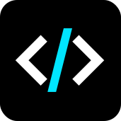

# TOKENICODE

### Claude Code 原生桌面客户端

**TOKENICODE** 将强大的 [Claude Code CLI](https://docs.anthropic.com/en/docs/claude-code) 封装在精美的原生桌面界面中 — 集成文件浏览、会话管理、快照回退、斜杠命令等丰富功能。

[**下载**](#安装) | [**功能详解**](#功能详解)

---

**[English](README.md)** | **[中文](README_zh.md)** | **[日本語](README_ja.md)**

## 功能一览

| | | | |
|:---:|:---:|:---:|:---:|
| **流式对话** | **文件浏览器** | **会话管理** | **快照与回退** |
| 基于 NDJSON 的实时流式输出，支持思考、输出和工具执行状态显示 | 浏览、预览和编辑项目文件，支持语法高亮 | 持久化会话，支持搜索、重命名、导出和恢复 | 在 Claude 修改文件前自动创建快照，可回退到任意对话轮次 |
| **斜杠命令** | **命令面板** | **国际化** | **主题** |
| 完整支持 Claude Code 斜杠命令，带自动补全 | `Cmd+K` 快速访问面板，一键执行各种操作 | 中英双语，可扩展的翻译系统 | 浅色、深色和跟随系统主题，多种强调色可选 |

## 快速开始

### 前置条件

- 已安装并认证 [Claude Code CLI](https://docs.anthropic.com/en/docs/claude-code)
- macOS 12+、Windows 10+ 或 Linux（需要 WebKit2GTK）

### 安装

#### macOS

从 [Releases](https://github.com/yiliqi78/TOKENICODE/releases) 下载最新的 `.dmg` 文件，打开后将 **TOKENICODE** 拖入应用程序文件夹。

#### Windows

从 [Releases](https://github.com/yiliqi78/TOKENICODE/releases) 下载最新的 `.msi` 或 `.exe` 安装包并运行。

#### Linux

从 [Releases](https://github.com/yiliqi78/TOKENICODE/releases) 下载 `.AppImage`、`.deb` 或 `.rpm` 安装包。

### 首次启动

1. 打开 TOKENICODE
2. 在欢迎界面或输入栏选择一个项目文件夹
3. 开始对话 — Claude CLI 会话在后台无缝运行

## 功能详解

### 流式对话

通过 NDJSON 流式传输与 Claude Code 实时对话。界面清晰展示不同阶段 — 思考中、输出中、工具执行中 — 每个阶段都有动画指示器。

### 文件浏览器

浏览完整项目目录树，支持展开/折叠。被 Claude 修改的文件会高亮标记。双击在 VS Code 中打开，或直接在内置 CodeMirror 编辑器中预览，支持完整的语法高亮。

### 快照与回退

每次 Claude 修改文件前，都会自动创建快照。通过回退面板（Rewind Panel）可以回到任意对话轮次 — 独立恢复代码、对话或同时恢复两者。

### 会话管理

所有 Claude Code 会话持久保存且可搜索。可以恢复之前的任意会话、重命名、导出为 Markdown/JSON，或在 Finder 中显示会话文件。

### 斜杠命令

完整支持所有 Claude Code 斜杠命令（`/ask`、`/plan`、`/compact`、`/model` 等），带自动补全弹出窗口，显示内置命令、项目命令和技能。

### 命令面板（Command Palette）

按 `Cmd+K` 打开快速访问命令面板，可用于新建对话、切换面板、切换主题等操作。

### 代理活动

实时监控 Claude 的子代理（Sub-agent）活动。查看各个代理的启动、思考、工具执行和完成状态。

### 技能与 MCP

直接在界面中管理 Claude Code 技能（创建、编辑、启用/禁用）和 MCP 服务器连接。

### 文件编辑

在内置 CodeMirror 编辑器中直接编辑文件，支持 12+ 种语言的语法高亮。无需离开应用即可保存更改。

### 国际化

完整的中英双语支持。所有用户界面字符串通过统一的 i18n 系统管理。可在设置中切换语言。

## 键盘快捷键

| 快捷键 | 操作 |
|--------|------|
| `Cmd+K` | 打开命令面板 |
| `Cmd+N` | 新建对话 |
| `Cmd+B` | 切换侧栏 |
| `Cmd+.` | 切换文件面板 |
| `Cmd+,` | 打开设置 |
| `Cmd+Enter` | 发送消息 |
| `Cmd++` / `Cmd+-` | 调整字体大小 |
| `Cmd+0` | 重置字体大小 |
| `Escape` | 关闭弹出层 / 取消 |

## 界面预览

**主界面** — 三栏布局
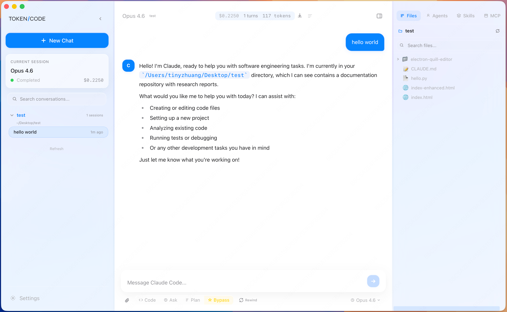

**流式对话** — 实时思考与输出
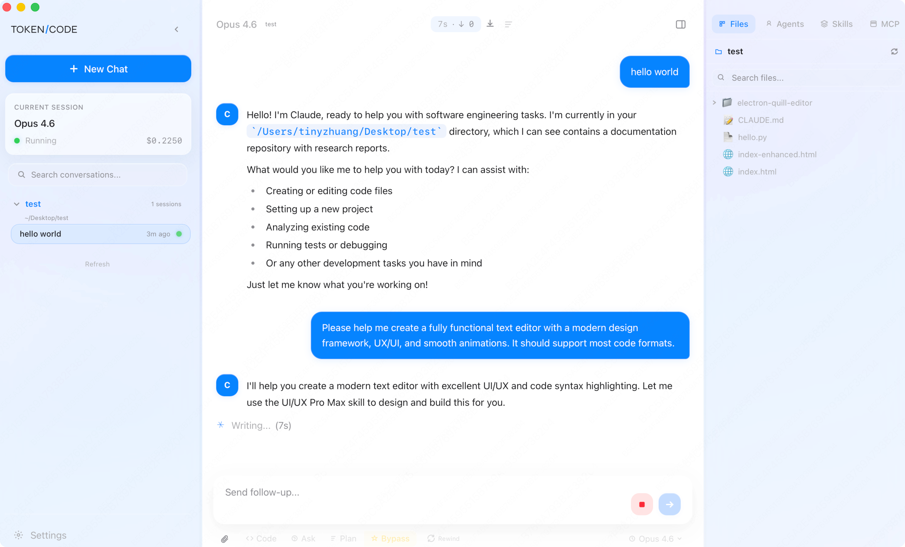

**会话管理** — 持久化会话，支持搜索与恢复
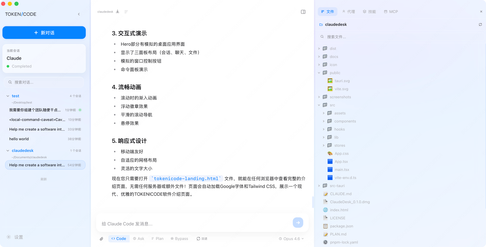

**文件浏览器** — 语法高亮预览
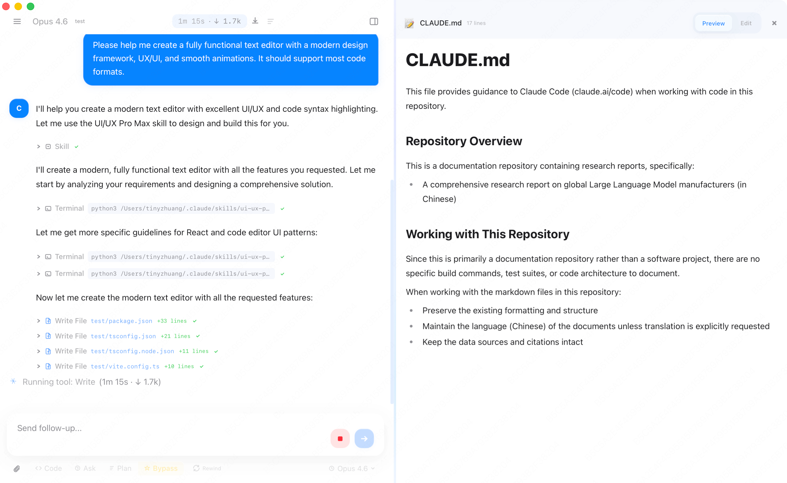

**文件编辑** — 内置 CodeMirror 编辑器，支持 12+ 种语言
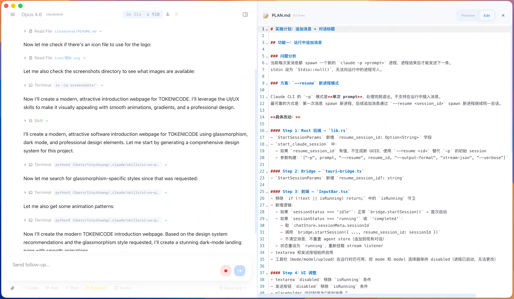

**斜杠命令** — 全命令自动补全
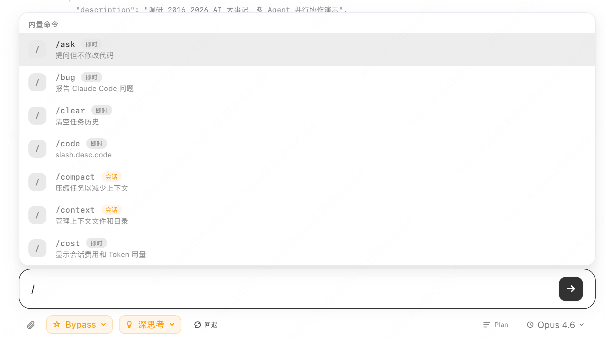

**计划模式** — 结构化实施方案规划
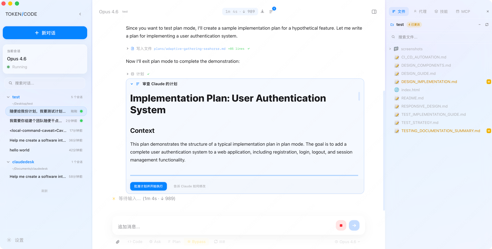

**快照与回退** — 回退到任意对话轮次
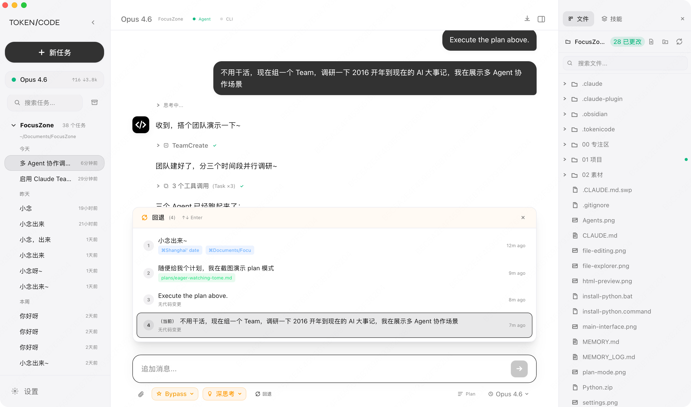

**代理活动** — 实时监控子代理任务

**技能管理** — 创建、编辑和管理技能
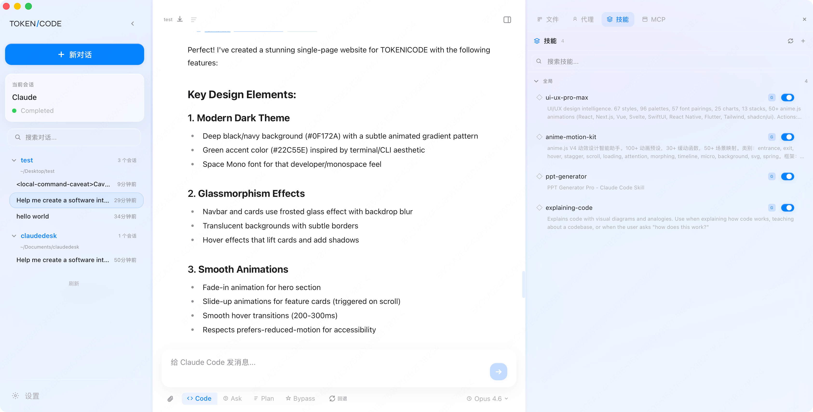

**HTML 预览** — HTML 文件实时预览
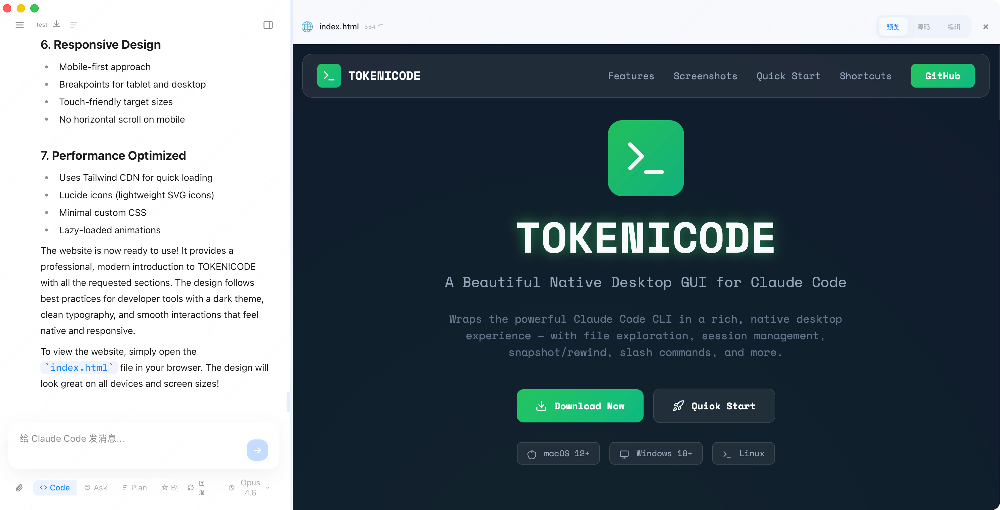

**设置** — 主题、强调色、国际化
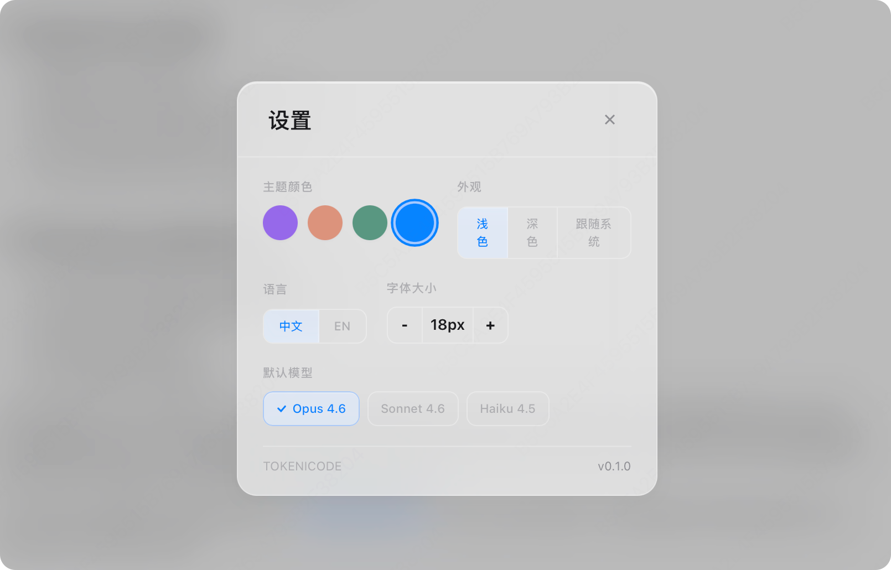

## 参与贡献

欢迎贡献代码！请提交 Issue 或 Pull Request。

- Fork 本仓库并创建功能分支：`git checkout -b feat/my-feature`
- 使用规范化提交格式：`feat: 添加新功能`
- 推送并创建 Pull Request

## 许可证

本项目采用 **Apache License 2.0** 许可证 — 详见 [LICENSE](LICENSE) 文件。

## 致谢

- [Anthropic](https://anthropic.com) — Claude Code CLI
- [Tauri](https://tauri.app) — 原生桌面应用框架
- [React](https://react.dev) 及开源社区

---

**如果你觉得 TOKENICODE 有用，请给个 Star 支持一下！**

