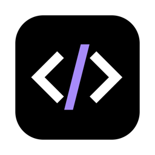

# TOKENICODE

### Claude Code 精美桌面客户端

**TOKENICODE** 为 [Claude Code CLI](https://docs.anthropic.com/en/docs/claude-code) 打造精美的桌面图形界面 — 自由接入第三方 API，原生支持国内服务商，提供文件管理、会话管理和结构化权限控制的完整体验。

[**下载**](https://github.com/yiliqi78/TOKENICODE/releases) · [**功能**](#功能) · [**截图**](#截图)

---

**[English](README.md)** | **[中文](README_zh.md)**

## 为什么选择 TOKENICODE？

| | | | |
|:---:|:---:|:---:|:---:|
| 🔑 **自带 API Key** | 🇨🇳 **国内可用** | 🛡️ **SDK 控制协议** | 🎨 **精美原生体验** |
| 6 个预设服务商 + 自定义接入点，配置一键导入导出 | Gitee 镜像更新、国内 API 预设（DeepSeek、智谱、通义千问、Kimi、MiniMax） | 结构化权限审批，4 种工作模式（code / ask / plan / bypass），stdin 输入 allow/deny | Tauri 2 原生桌面体验，多主题 × 明暗模式 |

## 安装

### 前置条件

- [Claude Code CLI](https://docs.anthropic.com/en/docs/claude-code) — TOKENICODE 会在首次启动时自动检测、安装和认证

### macOS

从 [Releases](https://github.com/yiliqi78/TOKENICODE/releases) 下载最新 `.dmg`，打开后将 **TOKENICODE** 拖入应用程序文件夹。

同时提供 Apple Silicon (arm64) 和 Intel (x86_64) 版本。应用已完成代码签名和公证，无需额外操作。

### Windows

从 [Releases](https://github.com/yiliqi78/TOKENICODE/releases) 下载 `.msi` 或 `.exe` 安装包并运行。要求 Windows 10 或更高版本。

### Linux

从 [Releases](https://github.com/yiliqi78/TOKENICODE/releases) 下载 `.AppImage`、`.deb` 或 `.rpm` 安装包。需要 WebKit2GTK。

> **国内用户：** 如果 GitHub 下载缓慢，可以从 [Gitee 镜像](https://gitee.com/yiliqiseven/TOKENICODE/releases) 获取安装包。应用在检测更新时也会在 GitHub 不可达时自动降级到 Gitee。

## 快速开始

1. **打开 TOKENICODE** — 如果未安装 Claude Code CLI，安装向导会引导你完成安装和登录，无需打开终端
2. **选择项目文件夹** — 在欢迎界面或输入栏选择
3. **开始对话** — Claude CLI 会话在后台无缝运行
4. **配置 API**（可选）— 打开 设置 → API Provider 添加第三方密钥或导入配置

## 功能

### 第三方 API 接入

支持通过任何兼容 API 接入点使用 Claude，不限于 Anthropic 官方 API。

- **6 个预设服务商**，可视化 2×3 网格展示：Anthropic、DeepSeek、智谱 GLM、通义千问 Coder、Kimi k2、MiniMax
- **自定义接入点**，支持 Anthropic 和 OpenAI 兼容格式
- **一键 JSON 导入**，方便在多台设备间同步配置
- **快速连接测试**，显示响应时间（如 `326ms`）
- **逐卡导出**，轻松备份

### 国内可用

TOKENICODE 专门为国内网络环境做了适配：

- **Gitee 更新镜像** — GitHub 不可达时自动降级到 Gitee 检查更新
- **国内 API 预设** — DeepSeek、智谱 GLM、通义千问 Coder、Kimi k2、MiniMax 已预配置正确的 API 地址
- **代理自动检测** — macOS 下自动继承系统代理环境变量
- **完整中文界面** — 可随时在设置中切换为中文

### SDK 控制协议

TOKENICODE v0.8.0 采用 Claude CLI 原生控制协议处理权限：

- 权限请求以结构化 JSON 通过 stdout 传递
- 响应为类型化的 `allow` / `deny` 消息，通过 stdin 回传
- 运行时切换 **code**、**ask**、**plan**、**bypass** 四种模式
- 无需重启会话即可切换模型

### 流式对话

基于 NDJSON 流式传输与 Claude Code 实时对话，界面清晰展示不同阶段：

- **思考中** — 旋转动画，Claude 正在推理
- **输出中** — 蓝色指示器，Claude 正在撰写回复
- **工具执行** — 动画展示文件编辑、命令执行等操作

### 会话管理

所有 Claude Code 会话持久保存，支持完整的管理操作：

- **置顶** — 将会话固定在项目组顶部
- **归档** — 隐藏不常用的会话，默认不显示
- **批量操作** — 多选模式，支持批量删除和归档
- **日期分组** — 今天 / 昨天 / 本周 / 更早
- **智能折叠** — 仅自动展开包含当前会话的项目组
- **AI 标题生成** — 首次回复后自动生成简短标题
- **撤销删除** — 5 秒恢复窗口，防止误删
- **搜索** — 支持仅显示运行中会话的筛选器
- **导出** 为 Markdown 或 JSON，支持重命名和恢复

### 文件浏览器与编辑器

浏览项目目录树，完整的文件管理能力：

- **SVG 文件图标**，20+ 文件类型彩色标识
- **变更标记**，高亮显示 Claude 修改过的文件
- **新建文件和文件夹**，右键菜单操作
- **扁平搜索**，显示相对路径上下文
- **内置 CodeMirror 编辑器**，支持 12+ 种语言语法高亮（Python、TypeScript、Rust、Go、Java、C++、SQL、Markdown、JSON、YAML、HTML、CSS、XML）
- **双击** 在 VS Code 中打开

### 检查点与回退

文件恢复使用 Claude CLI 原生检查点系统：

- 独立恢复 **代码**、**对话** 或 **两者同时**
- 基于 `--replay-user-messages` 和 CLI 文件检查点
- 对话时间线中集成恢复按钮

### 斜杠命令与命令面板

- 完整的 Claude Code 斜杠命令支持，带自动补全弹出窗口
- 显示内置命令、项目命令和技能
- **命令面板**（`Cmd+K` / `Ctrl+K`）快速访问新建对话、切换面板、切换主题和设置

### 代理活动

实时监控 Claude 的子代理 — 查看各个代理的启动、思考、工具执行和完成状态。

### 技能与 MCP

直接在界面中管理 Claude Code 技能（编辑、启用/禁用、右键菜单操作）和 MCP 服务器连接。

### 个性化定制

- **主题** — 多种强调色，支持浅色、深色和跟随系统模式
- **语言** — 完整中英双语支持，设置中可切换
- **字号** — 键盘快捷键调节
- **思考深度** — 5 档思考深度控制

## 键盘快捷键

| 快捷键 | 操作 |
|--------|------|
| `Cmd+K` | 打开命令面板 |
| `Cmd+N` | 新建对话 |
| `Cmd+B` | 切换侧栏 |
| `Cmd+.` | 切换文件面板 |
| `Cmd+,` | 打开设置 |
| `Cmd+Enter` | 发送消息 |
| `Cmd++` / `Cmd+-` | 调整字体大小 |
| `Cmd+0` | 重置字体大小 |
| `Escape` | 关闭弹出层 / 取消 |

> Windows/Linux 下将 `Cmd` 替换为 `Ctrl`。

## 技术栈

| 层级 | 技术 |
|------|------|
| 桌面框架 | [Tauri 2](https://tauri.app) |
| 前端 | [React 19](https://react.dev) + TypeScript 5.8 |
| 样式 | [Tailwind CSS 4](https://tailwindcss.com) |
| 状态管理 | [Zustand 5](https://zustand.docs.pmnd.rs)（10 个 Store） |
| 代码编辑器 | [CodeMirror 6](https://codemirror.net) |
| 构建工具 | [Vite 7](https://vite.dev) |
| 后端 | Rust（tokio、reqwest、serde、notify） |
| 包管理 | pnpm |

## 截图

**主界面** — 侧栏、对话、文件浏览器三栏布局

**流式对话** — 实时思考、输出和工具执行

**会话管理** — 置顶、归档、日期分组、批量操作

**文件浏览器** — SVG 图标、变更标记、扁平搜索

**文件编辑** — 内置 CodeMirror 编辑器，语法高亮

**计划模式** — SDK 权限审批卡片

**代理活动** — 实时监控子代理任务

**技能管理** — 右键菜单操作技能

**HTML 预览** — HTML 文件实时预览

**设置** — 四标签页布局，主题预览卡片

## 参与贡献

欢迎贡献代码！请提交 Issue 或 Pull Request。

- Fork 本仓库并创建功能分支：`git checkout -b feat/my-feature`
- 使用规范化提交格式：`feat: 添加新功能`
- 推送并创建 Pull Request

## 许可证

本项目采用 **Apache License 2.0** 许可证 — 详见 [LICENSE](LICENSE) 文件。

## 致谢

- [Anthropic](https://anthropic.com) — Claude Code CLI
- [Tauri](https://tauri.app) — 原生桌面应用框架
- [React](https://react.dev) 及开源社区

---

**如果你觉得 TOKENICODE 有用，请给个 ⭐ 支持一下！**

